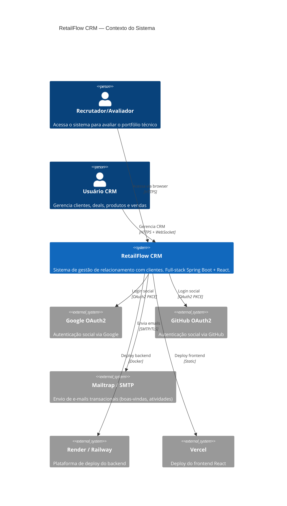
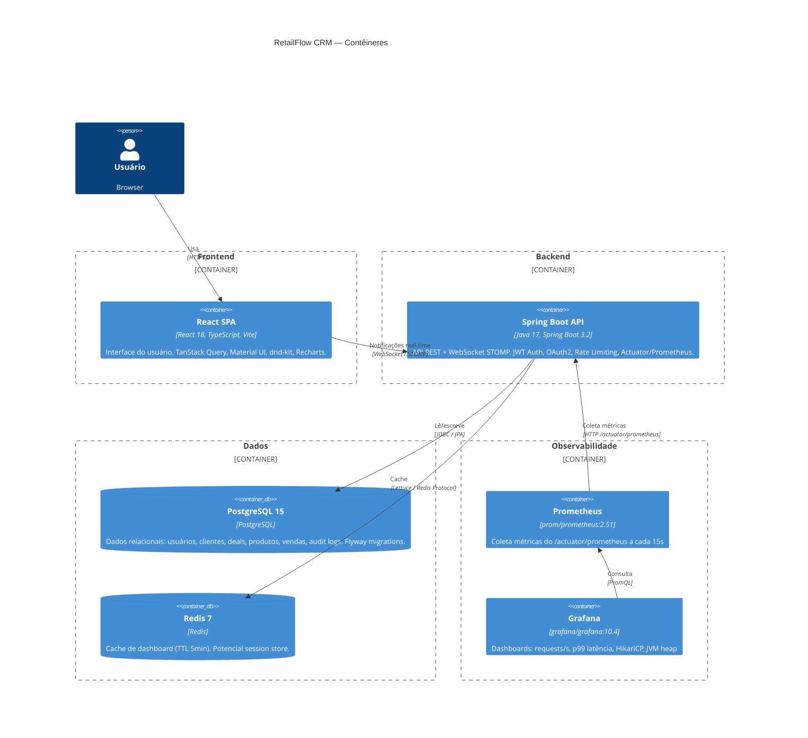
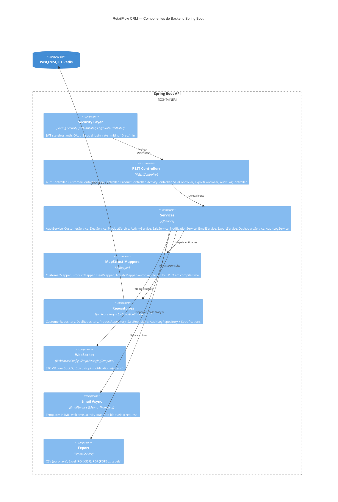

# RetailFlow CRM — Diagramas C4

> Diagramas de arquitetura em Mermaid (renderiza no GitHub)

---

## Nível 1 — Diagrama de Contexto (System Context)

---

## Nível 2 — Diagrama de Contêineres (Container)

---

## Nível 3 — Diagrama de Componentes (Backend)

